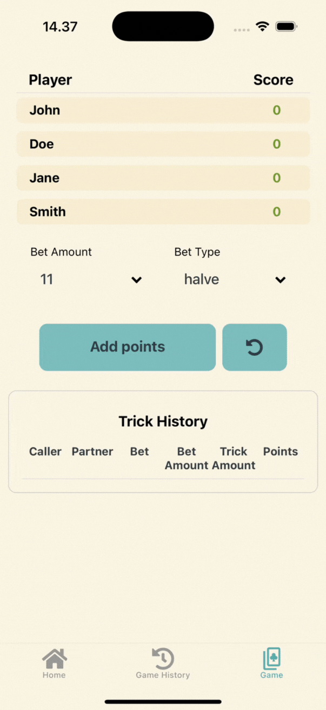

# Whist Point Tracker

**Overview**
The "Whist Point Tracker" is an application designed to manage and calculate scores for the card game Whist. I have deveeloped it as a hobby project to extend my skills in React and app development.

**Features**

- **Player Management**: Add, remove, and update player names.
- **Game Strategy Selection**: Choose from different scoring strategies (e.g., Classic, Lakse, Win Count) to calculate points based on bets and tricks.
- **Score Calculation**: Dynamically calculate scores based on selected strategies, bets, and game outcomes.
- **Game History**: View and manage previous games, including loading saved games and clearing history.
- **Interactive UI**: Dropdowns for bet selection, modals for trick amounts, and a scoreboard for real-time score updates.

  

**A quick overview of tools used**

- **Frameworks and Libraries**:

  - React Native: For building cross-platform mobile applications.
  - Expo: To streamline development and deployment.
  - Redux Toolkit: For state management.
  - React Navigation: For handling navigation between screens.
  - Jest: For unit testing.

- **Languages**:

  - TypeScript: For type-safe development.
